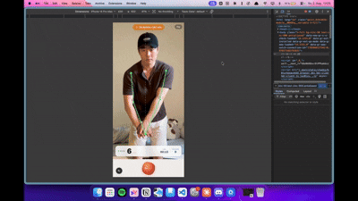
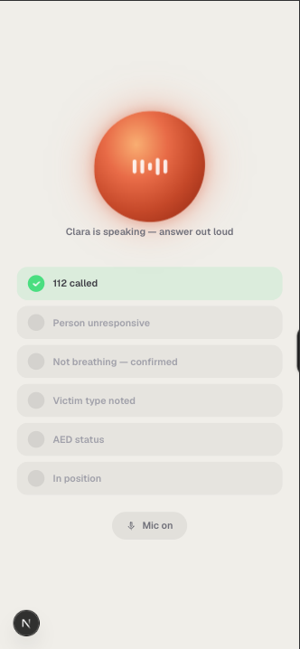
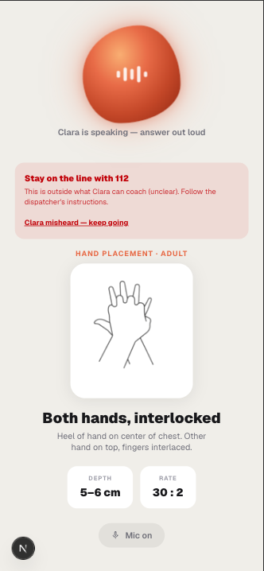
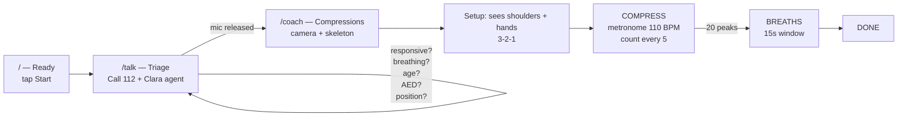
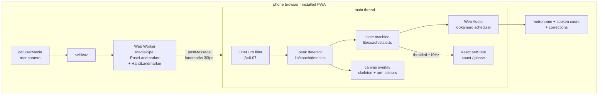
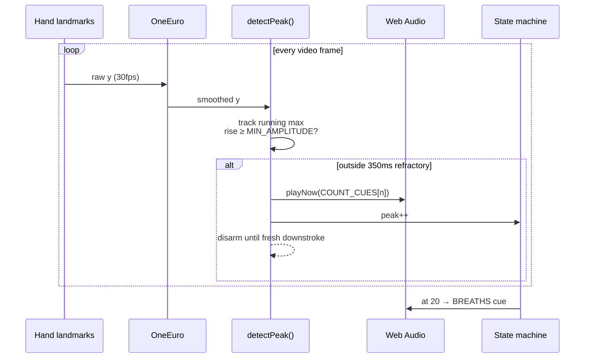

<div align="center">

# CPR Coach | 🏆 Winner — Mobile Hack Berlin 2026

**A phone-camera CPR coach that watches you and coaches you out loud.**

Prop the phone up. Start compressions. A metronome ticks at 110 BPM, a voice counts every fifth stroke, and the moment your elbows bend it tells you to straighten your arms — all from a single rear camera, running fully on-device.

       

<br />

## Demo

**Live compression detection · 110 BPM metronome · elbow-flare correction**



### The Clara triage flow

| 📋 Guided checklist | ✋ Hand placement |
|:---:|:---:|
|  |  |
| Clara ticks off 112 called → unresponsive → not breathing → victim type → AED → in position, all hands-free by voice. | While Clara talks, the screen shows the correct hand position, target depth, and 30:2 rate for the patient's age. |

</div>

> **Not a medical device.** Not clinically validated. A single camera cannot measure compression depth in centimetres — so the coach only ever talks about your compressions relative to your own. If someone is unresponsive and not breathing, call emergency services and follow the dispatcher.

---

## What it does

A bystander opens the PWA from their home screen, taps **Start**, and gets talked through the pre-CPR checks by Clara — an ElevenLabs voice agent that ticks off responsive / breathing / age / AED / position via client tools. When the user says they're in position, Clara hands off and releases the mic.

The camera goes full-bleed with a live skeleton overlay. A short setup waits until the pose model can actually see shoulders and hands, counts 3-2-1, and the metronome starts. From there:

- Every compression is detected from the vertical motion of the clasped hands.
- The count is spoken every 5th compression — every number would be maddening.
- Arm lines turn red when an elbow bends; Clara says "straighten your arms."
- At 20 compressions the state machine interrupts for the breath phase, then ends the round.

The 20:2 cycle is deliberately shortened from clinical 30:2 for demo pacing, and it runs one round instead of looping. Both live in `lib/coach/state.ts` if you want the real thing.

## The flow



## Quick start

```bash
npm install
npm run dev
```

That gets you `http://localhost:3000` on a laptop — enough for the triage screen and UI, but **the camera won't work on a phone over plain HTTP.** `getUserMedia` requires a secure context.

### On a phone (the part that actually matters)

**Local HTTPS**, same Wi-Fi. Generate a cert with [mkcert](https://github.com/FiloSottile/mkcert):

```bash
mkcert -install && mkcert -key-file certificates/localhost-key.pem -cert-file certificates/localhost.pem localhost 192.168.1.x
npm run dev -- -H 0.0.0.0 --experimental-https \
  --experimental-https-key certificates/localhost-key.pem \
  --experimental-https-cert certificates/localhost.pem
```

**Or a tunnel** — no cert, works off Wi-Fi:

```bash
npx cloudflared tunnel --url http://localhost:3000
```

Then **Add to Home Screen** and launch from the icon. Camera + mic permissions do not carry over from Safari to the installed PWA — it's a separate context. Test from the icon or debug the wrong thing. Remote inspect: Safari → Develop → *your iPhone*.

## Environment

All keys are optional except the ElevenLabs agent ID (required for the `/talk` screen). Missing keys degrade gracefully.

| Variable | Unlocks |
|---|---|
| `NEXT_PUBLIC_ELEVENLABS_AGENT_ID` | Clara triage agent on `/talk` — public by design (client-side WebSocket) |
| `ELEVENLABS_API_KEY` | Server-side re-generation of voice cues |
| `OPENAI_API_KEY` + `OPENAI_VISION_MODEL` | Hand-placement VLM check (route stubbed, not wired) |

Nothing else should ever get a `NEXT_PUBLIC_` prefix.

---

## Architecture

### The hot loop

Pose runs off-thread. The main thread schedules audio and draws. React only sees numbers you'd read out loud.



### The one rule

**The 30fps loop never touches React state.** Landmarks, the y-trace buffer, peak timestamps and the audio clock all live in `useRef`. Only rendered values go through `useState`, throttled. Push 30fps of landmarks through `setState` and the re-render storm jitters the audio scheduler — and this product is, fundamentally, a metronome.

MediaPipe runs in a worker for the same reason: main-thread inference audibly jitters Web Audio.

### Detecting a compression

MediaPipe's y axis points **down**, so the bottom of a compression is a local *maximum*.



Signal priority is **hand landmarks → pose wrists → shoulders**. Clasped hands are the stroke itself and give the cleanest trace; shoulders are the fallback when hands leave frame. Because those sources sit at different y offsets, a source switch **resets** the detector rather than firing a phantom peak — same for any single-frame jump over 0.06.

Simulated against synthetic signals it's exact at 70–150 BPM and holds up at 15fps. Practical sensitivity floor is ~0.02 peak-to-peak, not the 0.01 that `MIN_AMPLITUDE` suggests, because re-arming and firing each need their own excursion.

### Audio priority ladder

Cues **must never stack** — two voices talking over each other is worse than silence.

```
1. Phase instructions    ← interrupt everything
2. Metronome click       ← continuous baseline
3. Spoken count          ← on a detected peak
4. Form correction       ← between numbers, ≤1 per 5 compressions
```

All voice lines are pre-rendered ElevenLabs mp3s in `public/audio/`, decoded up front and played from `AudioBuffer`s. No live TTS at runtime — that's latency and network risk in the one loop that can't afford either. The metronome click is synthesized, so `click.mp3` being absent is fine.

On iOS, `AudioContext` has to be resumed on **every** user-gesture path, not just the first, and again after the agent releases the mic.

## Repository layout

```
app/
  page.tsx              Ready screen
  talk/page.tsx         Call 112 → ElevenLabs triage agent → handoff
  coach/page.tsx        Camera, skeleton overlay, setup sequence, counting
  api/placement/        VLM hand-placement stub (not wired)

lib/
  pose/
    worker.ts           MediaPipe worker (pose + hands)
    usePose.ts          Spawns the worker, returns landmarks via ref
    useCamera.ts        getUserMedia, rear camera by default
  audio/
    engine.ts           AudioContext, buffers, 110 BPM lookahead scheduler
    cues.ts             Cue name → mp3 path, plus COUNT_CUES
  coach/
    detect.ts           Peak detection — the core of the whole thing
    state.ts            Phase machine: IDLE → COMPRESS → BREATHS → DONE
  vision/
    geometry.ts         Landmark indices, 3D angle math
    landmark-filter.ts  OneEuro smoothing
    camera-feedback.ts  Out-of-frame detection

public/
  audio/                Pre-rendered voice cues (counts, corrections, phases)
  models/               MediaPipe .task models (pose lite + hands)
  mediapipe/wasm/       MediaPipe runtime, self-hosted
```

Both model files and the wasm runtime are committed and served locally — a CDN fetch is a network dependency at the worst possible moment.

## Constants worth knowing

| | value | where |
|---|---|---|
| Metronome | **110 BPM** | `lib/audio/engine.ts` |
| Refractory | 350 ms between peaks | `lib/coach/detect.ts` |
| Min amplitude | 0.01 (effective floor ~0.02) | `lib/coach/detect.ts` |
| Jump guard | 0.06 single-frame step | `lib/coach/detect.ts` |
| Cycle | 20 compressions, then breaths | `lib/coach/state.ts` |
| Stall timeout | 1500 ms | `lib/coach/state.ts` |
| Breath window | 15 s | `lib/coach/state.ts` |
| OneEuro β | 0.07 (raised from 0.02 — CPR is ~2 Hz) | `lib/vision/landmark-filter.ts` |

Changing any of these without testing on a phone is how you lose the demo.

## Key architecture invariants

- **The 30fps loop never touches React state.** Refs for landmarks, y-trace, peaks and the audio clock. `setState` only for count/phase, throttled.
- **MediaPipe runs in a Web Worker.** Main-thread inference audibly jitters Web Audio.
- **No live TTS.** All cues are pre-rendered mp3s in `public/audio/`, decoded up front.
- **Cues never stack.** Priority ladder above is enforced by the scheduler, not by hope.
- **No absolute depth claims.** A single camera cannot measure compression depth in cm; the coach only ever compares your compressions to your own.
- **Nothing leaves the phone during compressions.** No network calls in the hot loop.

## Status

**Working:** camera + pose pipeline, compression detection, 110 BPM metronome, spoken counts, elbow-flare correction, the 20:2 state machine, breath phase, ElevenLabs triage agent, PWA manifest and icons.

**Not built:** a numeric quality score, the y-trace debug plot (the canvas ref exists in `coach/page.tsx` but nothing draws to it), and the `/api/placement` VLM hand-placement check. `OPENAI_API_KEY` and `OPENAI_VISION_MODEL` are read by nothing right now.

The notes under [`notes/`](notes/) describe the intended full product and are ahead of what's actually in `lib/` — trust the code.

## Scripts

```bash
npm run dev      # dev server
npm run build    # production build
npm run lint     # eslint
```

There is no test suite. `references/` and `public/mediapipe/wasm/` are vendored and account for most of what `npm run lint` complains about.

---

Built at **8x × Bella&Bona Mobile Hack, Berlin — 2026**.
